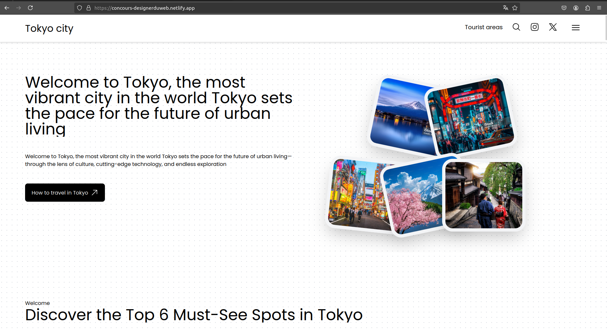

# README




## Présentation du Site : Tokyo

Bienvenue sur notre site dédié à la découverte de Tokyo, la capitale dynamique du Japon. Ce site a été conçu pour offrir une expérience immersive et informative sur cette ville fascinante.

### URL
[Visitez le site ici](https://concours-designerduweb.netlify.app/)

### Structure du Site

Le site est composé de cinq pages principales :

1. **Home** : Une introduction captivante à Tokyo, avec des images et des informations essentielles pour vous plonger dans l'ambiance de la ville.
  
2. **About** : Découvrez l'histoire et la culture de Tokyo. Cette page présente des éléments clés qui rendent cette ville unique et attrayante.
  
3. **Space Areas** : Explorez les différents quartiers de Tokyo. Chaque espace offre une atmosphère distincte et des attractions uniques.
  
4. **Testimonials** : Lisez les avis et les expériences de visiteurs qui ont exploré Tokyo. Cette page met en avant des témoignages authentiques pour vous inspirer.
  
5. **Contact** : Une page dédiée pour toute question ou demande d'information. N'hésitez pas à nous contacter pour plus de détails.

### Technologies Utilisées

Ce site a été développé en utilisant les technologies suivantes :

- **TypeScript (TS)** : Pour une gestion de type solide et une meilleure maintenance du code.
- **Vue.js** : Pour créer une interface utilisateur réactive et dynamique.
- **Tailwind CSS** : Pour un design moderne et personnalisé, facilitant la mise en page et le style.
- **GSAP** : Pour des animations fluides et engageantes, apportant une touche interactive à l'expérience utilisateur.

### Installation

Pour cloner et exécuter ce projet localement :

1. **Clonez le dépôt** :
   ```bash
   git clone  https://github.com/ElvinKyungu/ville-concours 
   ```

2. **Accédez au répertoire du projet** :
   ```bash
   cd ville-concours 
   ```

3. **Installez les dépendances** :
   ```bash
   npm install
   ```

4. **Démarrez le serveur de développement** :
   ```bash
   npm run dev
   ```

### Contribution

Les contributions sont les bienvenues ! Si vous souhaitez améliorer ce site, n'hésitez pas à ouvrir une issue ou à soumettre une pull request.


